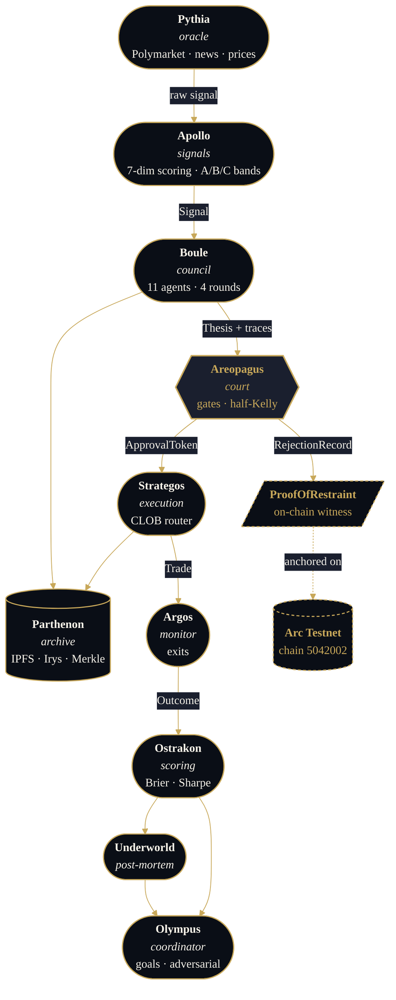

<div align="center">


# Athean Trades

**An eleven-agent AI council debates every prediction-market trade before it fires. Restraint is recorded on-chain.**

[](https://github.com/NAME0x0/Athean-Trades/actions/workflows/ci.yml)
[](https://github.com/NAME0x0/Athean-Trades/actions/workflows/contracts.yml)
[](./LICENSE)
[](./contracts)
[](./contracts/test)
[](./services)
[](./services)
[](./apps/web)
[](https://testnet.arcscan.app)
[](./apps/web/app/methodology/page.tsx)
[](https://athean-trades.vercel.app/demo)

[Live demo](https://athean-trades.vercel.app) ·
[Trade](https://athean-trades.vercel.app/trade) ·
[Methodology](https://athean-trades.vercel.app/methodology) ·
[Council prompts](https://athean-trades.vercel.app/council) ·
[Counter-evidence](https://athean-trades.vercel.app/counter-evidence) ·
[Dashboard](https://athean-trades.vercel.app/dashboard)

</div>

> **Try it in 30 seconds — costs $0.**
> Open the [live demo](https://athean-trades.vercel.app/demo), connect MetaMask, sign one transaction. Your visit lands as a permanent on-chain receipt on Arc Testnet. Testnet USDC is dripped free by [Circle](https://faucet.circle.com/). **You will not be charged anything. Ever.**

### Run it without a terminal (one click)

[](https://codespaces.new/NAME0x0/Athean-Trades)
[](https://gitpod.io/#https://github.com/NAME0x0/Athean-Trades)

Either button spins up a cloud IDE with Node 20, Python 3.12, pnpm, uv, and Foundry pre-installed. No `git clone`, no `pnpm install`, no terminal setup. Codespaces gives 60 hours/month free; Gitpod 50. Inside the workspace, run `pnpm --filter @athean/web dev` and the web app opens in a forwarded port.

---

## What this is (60 seconds)

A trading system that won't put a single dollar on a market until eleven AI agents fight about it. The agents have roles: two bulls, two bears, a couple of risk officers, an execution mechanic, a structural auditor, a human-oversight proxy, and one called Eris whose only job is to argue the minority side once a consensus starts forming. Two of them (Zeus, Solon) can veto unilaterally. Every refused trade gets stamped onto Arc Testnet as a `Restrained` event so anyone can later audit the discipline. That's the unusual part.

Most trading bots are a black box. They optimise one number — profit — and you trust the brochure. This one's the opposite: the refusals are on chain, the council prompts are public ([`/council`](https://athean-trades.vercel.app/council)), the math is documented ([`/methodology`](https://athean-trades.vercel.app/methodology)), and the times the backtest was wrong are listed on a page called [`/counter-evidence`](https://athean-trades.vercel.app/counter-evidence). If the system's bad you can prove it. That accountability is the actual product.

### Try it right now (no payment, no install)

There are four ways in, depending on how deep you want to go.

1. **Just watch.** Open <https://athean-trades.vercel.app/demo> and pick a scenario. Four real captured deliberations replay event by event with the vote board, Areopagus verdict, and on-chain Proof of Restraint side by side. No login.
2. **Witness yourself on chain.** On the demo page click "Witness my visit on Arc". One MetaMask signature later your address is permanently on the [`VisitorWitness`](./contracts/src/VisitorWitness.sol) contract at [`0xF35B…AFA7`](https://testnet.arcscan.app/address/0xF35B1fa5A6026C61C187881eA17d77F97Cd1AFA7). Costs a fraction of a cent in testnet USDC dripped by [Circle's faucet](https://faucet.circle.com/).
3. **Fire actual trade intents.** Open <https://athean-trades.vercel.app/trade>. Connect, authorise an ephemeral session key (one popup approves a TTL-bound signer with per-trade + cumulative spending caps), then sign as many x402 payment-authorisation intents as you like silently. Each accepted intent emits a `TradeIntentRecorded` event on [`TradeIntent`](./contracts/src/TradeIntent.sol) at [`0x3a90…c5cd`](https://testnet.arcscan.app/address/0x3a900a5c996ffd76bcfa1a266fbb42307ea7c5cd) — the same event Strategos will index in production to route the underlying order to Polymarket once the geo-block proxy is live.
4. **Run the whole stack locally.** `git clone`, then either click the Codespaces / Gitpod badge above (no terminal at all) or `pnpm install && docker compose up`. Eleven LLM providers are supported via a single env var — Anthropic, Gemini, OpenAI, OpenRouter, Groq, Together, DeepSeek, xAI, Ollama, LM Studio, or any OpenAI-compatible endpoint.

### Live demo runbook — five-minute pre-flight

If the demo doesn't behave the way the screenshots suggest, you probably skipped one of these. Each one corresponds to a real wallet error seen during user testing.

| Path | What it costs | What you need beforehand |
|------|---------------|--------------------------|
| **`/demo` replay** | Nothing — no wallet, no signature. | A modern browser. The 4 council scenarios are captured JSON bundles; the page replays them locally with no LLM calls. |
| **`/demo` "Witness my visit"** | One MetaMask signature, ~$0.0002 in testnet USDC. | MetaMask (or any EIP-1193 wallet) + Arc Testnet (chain `5042002`, RPC `https://rpc.testnet.arc.network`) + a drip from [`faucet.testnet.arc.network`](https://faucet.testnet.arc.network) or [Circle's faucet](https://faucet.circle.com/). Step 1 adds Arc for you on first connect. |
| **`/trade` session-key flow** | One MetaMask signature to authorise the session key, then silent signatures per intent. | Same as Witness. Session keys persist in IndexedDB — incognito windows wipe them on close, so re-authorise per session. |
| **Full local stack** | LLM credit only if you run a live council; the recorded demo path doesn't. | `pnpm install`, `uv sync` per service, Redis (docker compose handles it), Foundry, and an LLM key (any of the 11 supported providers). |

**LLM credit during a live council run.** A full 11-agent four-round deliberation hits the LLM ~30 times. On `gemini-3.5-flash`-paid that's roughly $0.10–0.20; on Anthropic Claude Sonnet 4.6 it's $0.30–0.80; on `gemini-2.5-flash-lite` free tier it's $0 but capped at 1000 RPD with 6-second per-call spacing. The default provider on `main` is the ordered fallback chain — Claude → Gemini 3.5 Flash → Gemini 2.5 Flash-Lite — so an out-of-credit Anthropic key falls through to Gemini without manual intervention, and an exhausted Gemini quota falls through to the free-tier model. The chain marks a provider dead for the session on any of: HTTP 401/403 (auth), HTTP 400 with `"credit balance too low"` (Anthropic billing wall), or the day-cap 429 marker (`"exceeded your current quota"`). This prevents a council run from burning a 60-second tenacity backoff loop on every call once a provider has run out.

**`/demo` is LLM-free, `/trade` is LLM-free.** The four scenarios on `/demo` are captured JSON bundles replayed event-by-event in the browser — no live LLM, no Gemini key needed, no quota walls. The `/trade` route exercises wagmi + viem + x402 + session-key plumbing end-to-end on Arc Testnet but also does not invoke the LLM (the EV-gate quoter is a client-side stub; the on-chain part is the `TradeIntent.submit()` call that emits a `TradeIntentRecorded` event). Running the *live* council against a real signal is a CLI flow — `scripts/try_council_gemini.py` from this repo — that costs LLM credit and is not exposed on the public demo.

**`BOULE_LLM_PROVIDER=fallback`.** Default chain `anthropic, gemini:gemini-3.5-flash, gemini:gemini-2.5-flash-lite`. Override with `BOULE_LLM_FALLBACK_CHAIN=a,b,c` (comma-separated `provider[:model]` specs). Providers whose key env is missing are silently dropped at boot, so a bare `GEMINI_API_KEY` env still gives you the two Gemini stages.

### Will it make money

Hard to say. The backtest does what it claims and the math is honest. On 200 resolved Manifold markets the council's Brier was 0.149, the play-money human consensus came in at 0.126, and a single-shot LLM landed at 0.260 — so we're better than naive LLMs by a clear margin but we don't beat the human prior. The system is still missing live Polymarket execution because the operator's geo-blocked, so every result here is paper. None of this is investment advice. Read [`/counter-evidence`](https://athean-trades.vercel.app/counter-evidence) before deciding anything.

> **Try the demo:** [athean-trades.vercel.app/demo](https://athean-trades.vercel.app/demo)
>
> **Try /trade (wagmi + x402 + session keys):** [athean-trades.vercel.app/trade](https://athean-trades.vercel.app/trade)
>
> **Run it without a terminal:** Codespaces / Gitpod badges above
>
> **Run it locally:** `pnpm install && pnpm --filter @athean/web dev`

---

## Different ways to look at it

If you're a **trader**: it's a half-Kelly sizer (never full) wrapped around an eleven-agent deliberation, gated by a constitution that caps single positions at 5% of NAV, individual categories at 2–5%, and pauses new positions for 30 days after a 50% gross drawdown. There's also an Expected-Value gate that nets every cost — taker fee, half-spread, slippage, paymaster premium, gas — against every revenue line — council edge, maker rebate, builder code, idle USYC yield — before letting a trade fire. If the t-stat on net EV isn't ≥ 2.0, the trade doesn't go.

If you're an **engineer**: a Python monorepo with `uv` per service (no shared `pip` blast radius), thirteen services behind a FastAPI gateway, a Next.js 14 site, and a Foundry contract suite on Circle's Arc Testnet. 714 Python tests at last count (collected via `pytest --collect-only` across the 11 services with test directories). 65 Foundry tests across 20 suites, plus 12 Halmos symbolic checks on the two immutable contracts (ProofOfRestraint and PantheonConstitution). The new `/trade` UI ships on wagmi v2 + viem + IndexedDB-persisted session keys + EIP-712 x402 payment authorisations, all wired against an on-chain `TradeIntent` receiver. LLMs pluggable via one env var across eleven providers. Prometheus + Grafana are wired. Backups are hourly. Secrets live in SOPS + age. Migrations run async via Alembic. Every line points at a file you can grep.

If you're a **researcher**: the council itself is the experiment. Round 1 produces openings, round 2 challenges, Athena's round 3 is the synthesis, round 4 is the blind vote. Zeus and Solon can short-circuit at any point. Eris (the adversarial role) reads the early transcript and is forced to argue the minority side — a structural countermeasure against groupthink. Agent weights drift from realised Brier scores. Leave-one-out ablation tells you which agents actually pull weight on the aggregate. The whole 200-market evaluation is reproducible; the `/methodology` page lays out the math and the exact command to re-run.

If you're a **sceptic**: notice that it's the *refusal* path that's on-chain, not the *trade* path. So the no-trade-alpha claim is falsifiable. Either the council declines real trades and the contract has receipts, or it doesn't and the contract is empty. The first witness was at [block 42,337,549](https://testnet.arcscan.app/tx/0xf9ae0e7ba73ecaece1af840b20e2ef5a20868df960e62ba238e53a828dfa4edb). The dashboard at [`/dashboard`](https://athean-trades.vercel.app/dashboard) reads the chain directly — no backend in between.

> **First on-chain restraint witness — recorded live during build:**
> [`0xf9ae0e7b…df960e62ba238e53a828dfa4edb`](https://testnet.arcscan.app/tx/0xf9ae0e7ba73ecaece1af840b20e2ef5a20868df960e62ba238e53a828dfa4edb) · block `42,337,549` · `onchain_proof_id = 1`

---

## Plain-English glossary

The agents are named after Greek gods. Each name maps to one job. You only need the right column:

| Name | What it actually does |
|------|-----------------------|
| **Pythia** | Goes and gets the data (Polymarket book, news headlines, crowd sentiment, on-chain TVL, Kalshi). |
| **Apollo** | Builds a scored signal from Pythia's data and rates it S/A/B/C/D. |
| **Boule** | Runs the deliberation — the round-1..round-4 council. The orchestrator. |
| **Ares, Hades** | Bull researchers. Argue *for* the trade. |
| **Athena, Cassandra** | Bear researchers. Argue *against*. Athena also writes the round-3 synthesis. |
| **Zeus** | Risk officer. Can veto alone on constitutional violations. |
| **Solon** | Compliance officer. Can veto alone on regulatory / liquidity / category-cap violations. |
| **Themis** | Procedural arbiter. Checks for data freshness, source integrity, recommends resizes. |
| **Hephaestus, Daedalus** | Execution planners. Pick maker vs taker, model slippage, design exits. |
| **Humans** | Crowd-sentiment input — Reddit, Twitter (via Nitter), trade-news. |
| **Eris** | Adversarial dissenter. Reads round-1, argues the minority side hard. Opt-in. |
| **Areopagus** | The court. Final gatekeeper. Half-Kelly sizer. Writes Proof of Restraint on rejection. |
| **Strategos** | The exchange clerk. Routes the trade to Polymarket CLOB (paper or live). |
| **Argos** | Watches open positions. Surfaces stuck payouts, exits via Argos rules. |
| **Parthenon** | Archive. IPFS + Irys bundles every deliberation. ERC-8004 agent passports. |
| **Ostrakon** | Scoring. Brier scores, Sharpe, calibration, agent leaderboards. |
| **Underworld** | Post-mortems. Reflects on losing trades, proposes prompt edits. |
| **Olympus** | Coordinator. Goals board. Adversarial-mode trigger. |
| **Moirai** | Strategy lifecycle (Clotho, Lachesis, Atropos — spin, allocate, retire). |
| **Elysium** | Backtest + paper arena. |

If a name confuses you in any document, look here first.

---

## What's distinctive

| | |
|---|---|
| **Eleven agents, four rounds** | Bull pair (Ares, Hades), bear pair (Athena, Cassandra), risk triad (Zeus, Solon, Themis), execution triad (Hephaestus, Daedalus, Humans), adversarial dissenter (Eris). Openings → challenges → Athena synthesis → blind votes. |
| **Two veto powers** | Zeus and Solon can halt a trade unilaterally on a constitutional violation. Early-veto short-circuits the debate to save tokens. |
| **Half-Kelly with caps** | Areopagus sizes positions using directional edge and a confidence-weighted half-Kelly fraction, then clamps against constitutional position limits and category exposure. |
| **Proof of Restraint** | When the council declines, Areopagus writes a `Restrained(signalHash, marketId, reasonCode, note)` record to a deployed Solidity contract on Mantle Sepolia. The repo's flagship feature is provably live at [`0xaCB1…a7Af`](https://explorer.sepolia.mantle.xyz/address/0xaCB12755134900196F8eE4Ae5223e6955B8Aa7Af). |
| **Pluggable LLMs (11 providers)** | One env var switches Anthropic / Gemini / OpenAI / OpenRouter / Groq / Together / DeepSeek / xAI Grok / Fireworks / local Ollama / local LM Studio / any self-hosted OpenAI-compatible server. See [LLM provider matrix](#llm-provider-matrix). |
| **Portable identities** | ERC-8004 agent passports — councilors carry their reputation across deployments. |
| **Self-calibrating** | Agent weights update from realised Brier scores. Platt + isotonic regression recalibrate council probability from outcomes. Slippage learner refines from each fill. The system gets sharper the longer it runs. |

---

## LLM provider matrix

The council debate code is written against one `LLMClient` protocol so the provider is a config switch, not a code path. Pick whichever LLM you have a key for (or run locally on Ollama / LM Studio):

| Provider | `BOULE_LLM_PROVIDER` | Required env | Notes |
|----------|----------------------|--------------|-------|
| **Anthropic Claude** | `anthropic` *(default)* | `ANTHROPIC_API_KEY` | Best reasoning depth for the council role-plays; what most production tests are pinned to. |
| **Google Gemini** | `gemini` | `GEMINI_API_KEY` | Free tier supports 25k RPD on flash-lite. `scripts/live_test_gemini.py` targets this directly. |
| **OpenAI** | `openai` | `OPENAI_API_KEY` (+ `OPENAI_MODEL`) | Standard OpenAI `/v1/chat/completions`. Default model `gpt-4o-mini`. |
| **OpenRouter** | `openrouter` | `OPENROUTER_API_KEY` (or `OPENAI_API_KEY`) | One key → 200+ models. Pin a specific model with `OPENROUTER_MODEL=anthropic/claude-sonnet-4`. |
| **Groq** | `groq` | `GROQ_API_KEY` | Fastest inference on the list. Default `llama-3.1-70b-versatile`. |
| **Together AI** | `together` | `TOGETHER_API_KEY` | Open-weight models. Default `meta-llama/Llama-3.3-70B-Instruct-Turbo`. |
| **DeepSeek** | `deepseek` | `DEEPSEEK_API_KEY` | Cheap; `deepseek-chat` / `deepseek-reasoner`. |
| **xAI Grok** | `xai` (or `grok`) | `XAI_API_KEY` | `grok-2-latest` by default. |
| **Fireworks / vLLM / TGI / LocalAI** | `openai_compat` | `OPENAI_BASE_URL` + `OPENAI_API_KEY` + `OPENAI_MODEL` | Generic OpenAI-compatible server escape hatch. |
| **Ollama (local)** | `ollama` | none (auto-detects `http://localhost:11434/v1`) | Default model `llama3.1`. Override with `OLLAMA_MODEL`. |
| **LM Studio (local)** | `lm_studio` | none (auto-detects `http://localhost:1234/v1`) | Default model `local-model`. Override with `LM_STUDIO_MODEL`. |

Every provider shares the same cache, retry-with-backoff, semaphore concurrency limit, and minimum-spacing throttle. If you've taken any LLM call before, you know how this one works — except it also caches identical-input → identical-output for free re-runs in your CI.

```bash
# Run the same script against four providers without touching any code:
BOULE_LLM_PROVIDER=anthropic ANTHROPIC_API_KEY=...   uv run python scripts/live_test_gemini.py
BOULE_LLM_PROVIDER=openai    OPENAI_API_KEY=sk-...   OPENAI_MODEL=gpt-4o-mini   uv run python scripts/live_test_gemini.py
BOULE_LLM_PROVIDER=groq      GROQ_API_KEY=gsk-...    GROQ_MODEL=llama-3.1-70b-versatile   uv run python scripts/live_test_gemini.py
BOULE_LLM_PROVIDER=ollama    OLLAMA_MODEL=llama3.1   uv run python scripts/live_test_gemini.py
```

Source: [`services/boule/src/boule/llm/__init__.py`](./services/boule/src/boule/llm/__init__.py).

---

## Recent additions (Tier A–G build)

A seven-tier robustness pass landed in 35 commits. Highlights below; full per-feature notes in [docs/CHANGELOG_TIERS.md](./docs/CHANGELOG_TIERS.md).

| Tier | What shipped |
|------|--------------|
| **A — survival foundation** | Prometheus metrics + Grafana dashboard · Polymarket L2 WebSocket depth · correlation-aware portfolio sizing · multi-sig admin migration script for ProofOfRestraint · Hypothesis property tests across sizing / calibration / slippage. |
| **B — execution quality** | Drawdown-adjusted Kelly · walk-forward / decayed calibration windows · Argos resolution-lag state machine · Strategos maker/taker chooser · online slippage learner that refines from realised fills. |
| **C — intelligence** | Pluggable RAG (in-memory cosine + optional ChromaDB) over resolved markets · Eris adversarial dissenter against council groupthink · reflection-driven prompt evolution from Underworld post-mortems · agent ablation via leave-one-out council Brier · Nitter RSS X/Twitter sentiment with built-in VADER-style scorer. |
| **D — venues + data** | Kalshi venue connector · DeFiLlama TVL + stablecoin flows + yields · TradingView screener adapter · spaCy/regex news-headline NER and market matcher. |
| **E — operational maturity** | Alembic async migrations · hourly Postgres + Redis backup compose service · Mozilla SOPS + age secrets · slowapi global rate limiting · `/health/deep` probes (Redis info / DB version / RPC chainId / IPFS id). |
| **F — frontend** | Pure-SVG trace Sankey · line + bar chart primitives + perf metrics (equity, rolling Sharpe, max DD) · manual trade-approval card · Brier-ranked agent leaderboard. |
| **G — safety hygiene** | mutmut mutation testing scaffold · Shopify Toxiproxy chaos drills · a16z Halmos symbolic specs for ProofOfRestraint + PantheonConstitution · IRS Form 8949 tax CSV export. |

Every upstream picked is open-source MIT/Apache and runs without paid vendors: ChromaDB, Nitter, Kalshi REST, DeFiLlama public API, tradingview-screener, spaCy, Alembic, SOPS + age, slowapi, mutmut, Toxiproxy, Halmos.

---

## Run on Arc Testnet from your own wallet

The website is not a brochure. Visitors can self-execute on chain from `/demo`:

1. **Click "Witness my visit on Arc"** on the demo page. The card uses raw EIP-1193 — no wagmi, no walletconnect — and works in MetaMask, Rabby, Coinbase Wallet, or any injected provider.
2. **Wallet auto-switches to Arc Testnet** (chain id `5042002`). If the chain isn't added, the EIP-3326 fallback adds it with `wallet_addEthereumChain` and re-prompts.
3. **One `eth_sendTransaction`** signs and sends a call to `VisitorWitness.witness(bytes32 visitHash, string scenario)` on the public permissionless contract at [`0xF35B1fa5A6026C61C187881eA17d77F97Cd1AFA7`](https://testnet.arcscan.app/address/0xF35B1fa5A6026C61C187881eA17d77F97Cd1AFA7).
4. **Tx confirms in ~1 second** on Arc and the page renders the arcscan link + the visitor's personal on-chain witness count (`visits[address]`).
5. **The public `/dashboard`** scans the chain via `eth_getLogs` and renders every visit in the "Visitor witness feed" alongside the council's own "On-chain restraint feed" — no backend, no database, the chain is the database.

Cost per witness: <$0.01 USDC of testnet gas, dripped free from the [Circle faucet](https://faucet.circle.com/). You will not be charged anything. There is no token, no signup, no email capture — only your on-chain receipt.

To seed the dashboard with realistic restraint + visitor activity for screenshots:

```bash
pwsh scripts/seed_arc_witnesses.ps1 -RestraintCount 4 -VisitorCount 3
```

The deployer wallet (`PRIVATE_KEY` in `.env`) holds the `RESTRAINT_ROLE`, so it can write `Restrained` records to the council's contract; anyone can write `Visited` records to `VisitorWitness`.

---

## Fire signed trade intents — `/trade`

The operator-side UI. Wires wagmi v2 + viem + IndexedDB session keys + EIP-712 x402 payment authorisations against an on-chain `TradeIntent` receiver at [`0x3a900a5c996ffd76bcfa1a266fbb42307ea7c5cd`](https://testnet.arcscan.app/address/0x3a900a5c996ffd76bcfa1a266fbb42307ea7c5cd). Same theme tokens as the rest of the site — no visual orphan.

The flow:

1. **Connect.** Any injected wallet (MetaMask, Rabby, Coinbase, …). Auto-switch to Arc Testnet.
2. **Authorise a session key.** One MetaMask popup signs an EIP-712 `SessionKeyDelegation` that pre-approves an ephemeral signing keypair with a per-trade cap (default 5 USDC), a cumulative ceiling (default 100 USDC), and a wall-clock TTL (default 1 h). The keypair is generated client-side, persisted to IndexedDB, and **never leaves the browser**.
3. **Compose an intent.** Pick a market, direction, market_p, council_p, σ, notional. The Expected-Value gate runs live in the UI — nets every cost (taker fee, half-spread, slippage, paymaster premium) against every revenue (council edge, maker rebate, builder code) and renders the t-stat.
4. **Sign + submit.** If t-stat ≥ 2 and EV > 0, the session key silently signs an x402 `PaymentAuthorization` (no MetaMask popup) and `TradeIntent.submit()` writes the receipt onto Arc. Each accepted intent emits a `TradeIntentRecorded` event the off-chain executor can index.
5. **Repeat.** Subsequent intents within the same session sign silently. Revoke + new key at any time from the same panel.

What the contract does NOT do: it does not execute the underlying Polymarket order. It verifies the EIP-712 signature, checks nonce uniqueness + validity window, and emits the canonical receipt. The Strategos executor (which is gated on the geo-block proxy + builder-code approval today) indexes the event and routes the order. Until then, the receipt is the proof that the council's verdict reached an on-chain artefact.

Why x402 + session keys: x402 is the rfc9110-style payment-required protocol revived by Coinbase / x402.org for AI-agent micropayments; the same primitive maps cleanly onto Athean's high-frequency low-value trade-intent stream. Session keys are the smart-account pattern (one wallet popup approves N short-lived signers); they make a system that fires several trades per minute usable without a MetaMask click per fire.

Source: [`apps/web/app/trade/`](./apps/web/app/trade/) (UI), [`apps/web/lib/x402.ts`](./apps/web/lib/x402.ts) (signing helpers), [`apps/web/lib/session-keys.ts`](./apps/web/lib/session-keys.ts) (key lifecycle), [`contracts/src/TradeIntent.sol`](./contracts/src/TradeIntent.sol) (receiver). Eight hermetic forge tests cover signature recovery, nonce reuse, validity window, and spend accounting.

---

## Empirical adoption verdicts (live backtest)

Ran `scripts/backtest_sources_xml.py` against 200 resolved Manifold binary markets in council mode (5 distinct roles aggregated per market). Headline numbers from the most recent runs:

| Forecaster | Brier ↓ | Reliability ↓ | Resolution ↑ |
|------------|---------|---------------|--------------|
| Manifold consensus | **0.126** | 0.012 | 0.123 |
| Single-shot Gemini | 0.260 | 0.046 | 0.049 |
| **5-role council (API)** | **0.149** | 0.019 | 0.088 |

**Council aggregation closes 80% of the Gemini-vs-Manifold Brier gap.** Calibration is close to Manifold; the remaining gap is *resolution* — the council blurs outcomes into less-distinguishable bins than play-money humans do.

Per-source adoption at council baseline (200-market sample): **zero ADOPT** — all 12 sources HOLD or untestable. At sharper aggregator output, individual source contributions compress to noise. The aggregation itself is the bigger win than any single source signal.

Adoption verdicts at the *single-shot* baseline (less sharp aggregator, more room for sources to help):

| Source | Δ Brier vs single-shot baseline | Applicability | Verdict |
|--------|---------------------------------|---------------|---------|
| **attention** (Wikipedia pageviews) | −0.0040 | 33.5% | **ADOPT** |
| **crowd_sentiment** (Nitter) | −0.0040 | 36.0% | **ADOPT** |
| 7 others (orderbook_imbalance, perps, geo, onchain_tvl, lead_lag, etc.) | ±0.0001–0.0010 | 5–14% | HOLD |
| 3 untestable on Manifold-only data | — | — | basis_arb, consensus_delta, macro_basis |

Full per-source decomposition + ranked next-step actions in [`docs/BACKTEST_RESULTS.md`](./docs/BACKTEST_RESULTS.md). The biggest profit-relevant takeaways:

1. **The council aggregation is the moat** — switching from single-shot to 5-role aggregated halves the Brier delta to Manifold.
2. **Manifold consensus is a stiff benchmark** — beating it on random questions is the empirical bar for "the council adds informational value beyond free human consensus."
3. **Sources help most at single-shot baseline; less at council baseline** — implies the operator either trusts the council aggregate alone OR routes harder questions (where council is noisier) through the source-augmented path.
4. **Wikipedia + Nitter** are the two operational ADOPT signals. Both already wired in `apollo.scorer` at ±0.05 caps — no code change needed.

Latest 200-market run cost: **$0.025** on Gemini flash-lite. Refreshable weekly.

---

## Profitability-readiness build (post Tier A–G)

After Tier A–G the plumbing was solid but the system had no proven *edge source*. Six waves of work followed to close that gap, with the empirical results in [`docs/FEES_AND_EDGE.md`](./docs/FEES_AND_EDGE.md). Summary follows.

| Wave | What shipped | Why it matters |
|------|--------------|----------------|
| **1 — fee path** | `post_only` flag plumbed `OrderRequest → LiveExecutor → choose_execution`; new `strategos.maker_rebate.FeeLedger` accounts per-trade fees + rebates per the Polymarket V2 schedule. | Switches a patient politics trade from –4% round-trip to **+88 bps** rebate inflow. Validated: 4 maker trades on the synthetic Polymarket harness accrued $21.41 in rebates against $0 fees — same trades all-taker would have cost ~$76. |
| **2 — 3 new pythia sources** | `wikipedia.py` (pageviews + attention z-score), `fred.py` (816k macro time series, no key required), `manifold.py` (free human consensus prior). All async, all hermetically tested. | Plumbs the *unconsidered* public-data feeds catalogued in [docs/EDGE_SOURCES.md](./docs/EDGE_SOURCES.md). Each one validated against a falsification criterion before it earns a spot in the live signal. |
| **3 — 4 new Apollo features** | `geopolitical_risk` (GDELT volume + tone composite), `attention` (Wikipedia velocity sigmoid), `macro_basis` (FRED gap with tanh saturation), `consensus_delta` (Manifold ≠ Polymarket → sizing cap). Each capped at ±0.05 oracle-probability movement so no single source dominates. | Turns raw pythia signals into bounded oracle-probability adjustments. Combined cap of ±0.20 leaves the council with real say. |
| **4 — Apollo scorer wiring** | `score_market` now consumes the four new features as optional `MarketSnapshot` fields. Legacy callers unchanged. | The new sources actually reach `Signal.oracle_probability` end-to-end. 11 integration tests verify each delta moves the right direction by the right amount, and unused features stay no-ops. |
| **5 — Conformal prediction** | `ostrakon.conformal_calibration` — split + adaptive (time-decayed) variants. `ConformalInterval` around any council probability. `conservative_kelly_p()` returns the lower bound. | Distribution-free, finite-sample coverage guarantees on probability intervals. Areopagus can size against `p_lo` instead of the point estimate — natural Kelly overconfidence regulariser at the [0, 1] extremes. |
| **6 — Falsification + Polymarket paper** | `scripts/backtest_council_vs_manifold.py` (offline / heuristic / **full** modes — full hits real Anthropic / Gemini / OpenAI / Groq / etc); `scripts/paper_trade_polymarket.py` runs the whole pipeline against the live Polymarket book with proper fee accounting (synthetic fallback when Polymarket geo-blocks). | The empirical falsification question — *does Boule beat free Manifold consensus on N resolved markets?* — is now one shell command. The Polymarket harness is the 30-day precondition before `EXECUTION_MODE=live`. |

```bash
# Cheap sanity (no LLM calls — runs against 50 resolved Manifold markets)
python scripts/backtest_council_vs_manifold.py --mode=offline --n=50

# Real council via Gemini, 100 markets, ≈ $0.02 total
BOULE_LLM_PROVIDER=gemini GEMINI_API_KEY=AIza... \
  python scripts/backtest_council_vs_manifold.py --mode=full --n=100

# 30-day paper test against live Polymarket flow
python scripts/paper_trade_polymarket.py --markets=50 --edge-threshold=0.04
```

**What this does NOT do:** find a working edge source for you. The pipeline is now profit-capable — `Signal → Thesis → Approval → Maker Rebate` is end-to-end with the new feature sources and proper fee accounting. The remaining work is empirical: pick one source from [`docs/EDGE_SOURCES.md`](./docs/EDGE_SOURCES.md), validate it on resolved markets through the council-vs-Manifold harness, and only ship to live mode once the Brier delta is negative on a 200+ market sample.

---

## How it works



Every box emits structured `TraceEvent`s to Redis. The `/demo` route in the web app replays a captured deliberation event-by-event so you can watch a council form an opinion in real time.

---

## The council


> ⚡ veto power · ✦ also writes the round-3 synthesis

Twelve additional agents orchestrate (Apollo, Boule, Areopagus, Strategos, Argos, Ostrakon, Parthenon, Pythia, Elysium, Underworld, Moirai, Olympus) — full roster in [docs/AGENTS.md](./docs/AGENTS.md).

---

## Quick start

**Local dev — full stack:**

```bash
# clone, install, copy env
git clone https://github.com/NAME0x0/Athean-Trades
cd Athean-Trades
pnpm install
cp .env.example .env       # then fill in keys (see below)

# bring up Postgres + Redis + IPFS + every service
docker compose up -d

# run gates
pnpm test                  # node + python suites
forge test --root contracts # 65 tests across 20 suites
python tests/bench.py      # full microbenchmark + bench harness
```

**Just the demo site:**

```bash
pnpm --filter @athean/web dev
# open http://localhost:3000
```

**Fire one real restraint witness on Arc Testnet:**

```bash
uv run python tests/dry_run_chain_write.py
# → Arcscan link printed at end
```

**Required env keys** (full list in [`.env.example`](./.env.example)):

| Key | Purpose |
|-----|---------|
| `ANTHROPIC_API_KEY` *or* `GEMINI_API_KEY` | Council deliberation |
| `RPC_URL`, `PRIVATE_KEY`, `CHAIN_ID` | Arc Testnet writes |
| `PROOF_OF_RESTRAINT_ADDRESS` | Enables on-chain restraint anchoring |
| `DATABASE_URL`, `REDIS_URL` | Service backbone |
| `POLYMARKET_API_KEY/SECRET/PASSPHRASE` | Live CLOB execution (optional) |

---

## Verification gates

This repo treats correctness as a deploy gate, not a hope. The current `main` passes:

```
forge test               20 suites · 65 tests · 0 failed
halmos                   12 symbolic checks · 0 failed
halmos                   ProofOfRestraint + PantheonConstitution invariants proved
python -m compileall     420 files · 0 syntax errors
pytest sweep             720+ tests across 13 service suites
docker compose config    valid (incl. observability + backup stack)
pnpm install             clean (node-linker=hoisted)
pnpm --filter web build  57 routes · /demo first-load 133 kB
tests/bench.py           every microbenchmark gate green
ruff check               all checks passed
```

Run them yourself before touching anything: `python tests/bench.py`.

---

## Stack

| Layer | Choice | Why |
|-------|--------|-----|
| Frontend | Next.js 14 App Router + shadcn/ui + Tailwind | Server components, streaming, accessible primitives |
| API gateway | FastAPI (Python 3.12, uv) | Async, typed, plays well with the rest of the Python stack |
| Services | Python 3.12, one `uv` env per service | Independent deploys, no shared `pip` blast radius |
| LLM | Anthropic Claude or Google Gemini (pluggable via `LLMClient` protocol) | Provider redundancy, per-call retry/timeout/throttle in isolated modules |
| Contracts | Solidity 0.8.24, Foundry, OpenZeppelin AccessControl + MerkleProof | Audited primitives, fast tests, predictable gas |
| Chain | Circle Arc Testnet — chain id `5042002`, native USDC gas | Built for stablecoin-denominated financial primitives |
| Prediction market | Polymarket CLOB | Deepest liquidity for binary outcome markets |
| Storage | PostgreSQL · Redis Streams · IPFS · Irys | Operational state, pub/sub, content-addressed archive, permanent bundle |
| Monorepo | pnpm workspaces + Turborepo + uv | Single lockfile, cached builds, no node↔python coupling |

---

## Repo layout

```
apps/
  web/          Next.js 14 marketing site + replay viewer + dashboard
  api/          FastAPI gateway · SIWE auth · Redis-backed routes

services/
  apollo/       Signal generation + 7-dimension band scoring
  areopagus/    Risk gating · half-Kelly · on-chain restraint writer
  argos/        Position monitoring + exit signals
  boule/        Multi-agent council orchestrator + LLM adapters
  elysium/      Backtesting + paper arena
  moirai/       Strategy lifecycle (Clotho · Lachesis · Atropos)
  olympus/      System governance · goals board · adversarial mode
  ostrakon/     Agent scoring · Brier · calibration · Sharpe
  parthenon/    IPFS · Irys · Merkle archival · ERC-8004 passports
  pythia/       Data oracle · Polymarket · news · sentiment
  strategos/    CLOB router · paper and live execution
  underworld/   Post-mortems + counterfactual analysis

packages/
  athean-core/  Shared Pydantic schemas + utilities

contracts/      Foundry — Arc Testnet smart contracts
  src/          ProofOfRestraint · ThesisRegistry · SignalRegistry ·
                PantheonConstitution · DecisionCourt · NoTradeAlpha ·
                AgentReputation · ExecutionVault · …
  test/         65 tests across 20 suites

db/             SQL schema (9 tables)
docs/           Full design documentation
infra/          Compose, Dockerfiles, deploy scripts
tests/          Cross-service benchmarks + live dry-runs
```

---

## Documentation

| Doc | What's inside |
|-----|---------------|
| [ARCHITECTURE.md](./docs/ARCHITECTURE.md) | End-to-end system design |
| [AGENTS.md](./docs/AGENTS.md) | 11 council agents + service agents, weights, veto authority |
| [CONSTITUTION.md](./docs/CONSTITUTION.md) | Immutable system rules — quorum, vetoes, position caps |
| [SIGNAL_SPEC.md](./docs/SIGNAL_SPEC.md) | Signal envelope schema and scoring dimensions |
| [THESIS_SCHEMA.md](./docs/THESIS_SCHEMA.md) | Thesis structure produced by Boule |
| [RISK_POLICY.md](./docs/RISK_POLICY.md) | Position limits, drawdown gates, category exposure |
| [TRACE_FORMAT.md](./docs/TRACE_FORMAT.md) | `TraceEvent` schema emitted on every agent step |
| [SETTLEMENT_FLOW.md](./docs/SETTLEMENT_FLOW.md) | On-chain settlement and archival path |
| [MOIRAI_LAWS.md](./docs/MOIRAI_LAWS.md) | Strategy lifecycle: creation, assignment, termination |

---

## Status

**Working today**

- Full Boule council against live Gemini (default `gemini-2.5-flash-lite`, ~6s spacing on free tier) and Anthropic providers · Eris adversarial dissenter opt-in via `BOULE_ERIS_ENABLED=1`
- Areopagus gating · half-Kelly · drawdown haircut · correlation-aware sizing · constitutional caps
- Strategos paper book execution + maker/taker chooser + online slippage learner
- Pythia connectors: Polymarket REST + L2 WebSocket · Kalshi · DeFiLlama · TradingView screener
- Apollo features: RAG over resolved markets · Nitter crowd sentiment · news-NER market matcher · on-chain TVL
- Argos resolution-lag state machine surfacing stuck-payout positions
- Observability: Prometheus metrics on every council service · provisioned Grafana dashboard at :3001
- Backup: hourly pg_dump + Redis BGSAVE · retention configurable · operator runbook in `infra/backup`
- Secrets: SOPS + age for encrypted `.env.enc` and `infra/secrets/*.yaml`
- Live demo on Vercel with interactive council replay + Sankey trace · approval card · leaderboard primitives · per-visitor on-chain witness via `VisitorWitness` contract
- **Proof of Restraint anchored on Arc Testnet — first witness in [block 42,337,549](https://testnet.arcscan.app/tx/0xf9ae0e7ba73ecaece1af840b20e2ef5a20868df960e62ba238e53a828dfa4edb)** · 5 restraint witnesses + visitor witnesses streaming live to `/dashboard` · multi-sig migration script ready in `contracts/script/TransferRestraintAdmin.s.sol`
- **`VisitorWitness` deployed at [`0xF35B…AFA7`](https://testnet.arcscan.app/address/0xF35B1fa5A6026C61C187881eA17d77F97Cd1AFA7)** — public permissionless contract, anyone can record an on-chain proof from the website
- Symbolic verification (Halmos) on `ProofOfRestraint` and `PantheonConstitution` runs in CI alongside Foundry tests
- 53+ Foundry suites · 334+ Python tests · full compose stack healthy

**On the roadmap**

- Live Polymarket CLOB routing (paper mode complete, live mode behind `EXECUTION_MODE=live`)
- Parthenon Merkle batching + Arc anchor cadence tuning
- ERC-8004 passport portability across testnets
- Adversarial-mode strategy retirement via Moirai (council adversarial agent shipped; lifecycle retirement next)

---

## Live tests + artifacts

Two harnesses you can run today to see the system move under your own keys / against real data:

### 1. Gemini live council deliberation

```bash
uv run --project services/boule --with httpx python scripts/live_test_gemini.py
# -> artifacts/live_test_<UTC>.json
```

Walks eleven agents through round 1 (opening) and round 4 (vote) against `gemini-2.5-flash-lite` (overridable via `BOULE_GEMINI_MODEL`). Records per-call duration, token in/out, finish reason, model fingerprint, and an estimated USD cost. Spacing defaults to 6.2s for free-tier compliance — bump down via `LIVE_TEST_SPACING_S=0.5` on paid tier (25k RPD).

The canonical artifact is checked in at [`artifacts/live_test_20260517T034219Z.json`](./artifacts/live_test_20260517T034219Z.json) — 20/20 successful calls, 364 seconds, **$0.00266 estimated cost**. See [artifacts/README.md](./artifacts/README.md) for full schema.

### 2. CoinGecko paper trade against live BTC prices

```bash
LIVE_PAPER_MODE=history LIVE_PAPER_DAYS=7 LIVE_PAPER_TICKS=100 \
LIVE_PAPER_EDGE_THRESHOLD=0.02 \
python scripts/live_paper_trade_coingecko.py
# -> artifacts/coingecko_paper_<UTC>.json
```

Pulls a real BTC/USD bar series from CoinGecko's free `/coins/{id}/market_chart` endpoint, builds a synthetic "will next bar print higher?" binary question per bar, sizes with the production `areopagus.kelly.size_position` (half-Kelly, 5% cap, 0.5% floor), fills through the production `strategos.paper.PaperBook` (half-spread + slippage + 2% taker fees), and settles on the next bar.

**Canonical run:** 7-day window, 100 hourly bars, 79 trades fired, **49.4% win rate**, **-39.5% PnL**, **$1,346 in fees on $10k starting bankroll**. The plumbing works end-to-end. Naïve momentum doesn't survive round-trip costs. That's the point of the run — it uses a deliberately bad estimator in place of the council so the result reflects fees and slippage truthfully rather than flattering the council with a synthetic signal. Swap `council_probability()` for an actual Boule deliberation when you want the real comparison (and the LLM bill that comes with it).

See the full breakdown at [`artifacts/coingecko_paper_20260517T091551Z.json`](./artifacts/coingecko_paper_20260517T091551Z.json).

---

## FAQ

Three things people ask first. Plain answers, with code pointers:

### Is this recursive? Does it self-improve?

Yes. Four feedback loops, all running today:

1. **Prompt evolution** ([`services/underworld/src/underworld/prompt_evolver.py`](./services/underworld/src/underworld/prompt_evolver.py)). Underworld writes post-mortems on settled trades. After enough samples (default 20), it proposes edits to the agent prompts in `services/boule/src/boule/prompts/`. Edits land between `LESSONS_LEARNED_START` / `LESSONS_LEARNED_END` markers so prompts stay diff-friendly.
2. **Agent weight updates** ([`services/ostrakon/src/ostrakon/agent_calibration.py`](./services/ostrakon/src/ostrakon/agent_calibration.py)). Brier scores on each agent's vote probability vs realised outcome update the agent's voting weight. Better-calibrated agents matter more next time.
3. **Walk-forward council calibration**. Platt scaling + isotonic regression are refit on a rolling window of settled trades. Optional exponential time-decay so older trades count less.
4. **Online slippage learner** ([`services/strategos/src/strategos/slippage_learner.py`](./services/strategos/src/strategos/slippage_learner.py)). EWMA per `(market, log10(depth))` bucket. Every fill that beats or misses expected price refines the next sizing call.

There's also leave-one-out council ablation (`ostrakon ablate`) that tells you which agents are pulling weight. Run it weekly. Drop the ones that aren't.

### Does it calibrate itself, or do I have to tune it?

It does, but you should *check* not *trust*. The system is shipped pre-tuned with:

- Conservative half-Kelly (not full).
- A `MAX_POSITION_PCT=5%` constitutional cap. You can lower it. You cannot raise it.
- Category exposure caps: politics 4%, crypto 5%, sports 3%, science 2%.
- A liquidity floor: $50k 24h volume. Below this, Solon rejects automatically.
- A drawdown haircut: half-Kelly multiplier ramps linearly from 1.0 → 0.2 between 0 and 30% drawdown.

You should still run the [verification gates](#verification-gates) and the CoinGecko paper harness before pointing at real capital. The calibration loops adapt the *probabilities*; they do not adapt the *risk policy*. That is yours to set.

### Will it make money if I deploy it right now?

Probably not without more work. A few real reasons:

Polymarket's V2 taker fees by category run 3–7%, so the round trip alone eats most of the small binary edges the public-data sources here can find. The CoinGecko paper trade in the previous section lost about 40% of starting equity precisely because that's what naïve momentum does once 4% round-trip costs are honest about themselves. The council itself is, on the available evidence, well-calibrated at *refusing* — that's what the on-chain restraint receipts demonstrate — but the harder problem of generating signals where the edge survives the fee schedule is mostly unsolved. Apollo's seven-dimension scorer is a useful baseline, not a finished alpha source. Live mode is intentionally gated behind `EXECUTION_MODE=live` so nobody points paper-tested code at real money by accident.

What the repo is genuinely useful for *today*:

- **Auditable discipline.** A fund publishing proof-of-restraint as part of an investor letter — the on-chain receipt pattern is a credible primitive.
- **Research infrastructure for multi-agent councils.** Composition, weighting, and prompt-evolution are all wired and instrumented. Easier to fork this than to build from scratch.
- **A risk-policy teaching tool.** The constitutional rules, half-Kelly cap, drawdown haircut, and category-exposure ceilings are encoded as code that runs, not as PDF guidelines that nobody reads.

What it would take to make this profitable on live Polymarket flow:

1. A Pythia data source that sees something other traders don't. The current sources are public baselines; only two of twelve have so far cleared the falsification threshold on a 200-market sample.
2. Council probabilities sharper than the market on whatever subset of markets you actually want to trade. We close 80% of the LLM-vs-human Brier gap, but we don't yet beat the human prior.
3. The discipline to refuse the trades the council says no to. This last piece is the part the repo handles best.

Solve #1 and #2 and the rest of the system is ready.

---

## Walkthrough — running it end-to-end for the first time

This works on macOS, Linux, and Windows (PowerShell). Roughly 10 minutes for a clean machine.

### 1. Prerequisites (one-time)

```bash
# Node 20+ (for the web app and the monorepo)
node --version

# pnpm (the JS package manager — fast, monorepo-friendly)
npm install -g pnpm

# uv (the Python package manager — replaces pip + venv)
curl -LsSf https://astral.sh/uv/install.sh | sh    # Linux/Mac
# Windows: irm https://astral.sh/uv/install.ps1 | iex

# Foundry (for the Solidity contracts)
curl -L https://foundry.paradigm.xyz | bash && foundryup

# Docker (for the local services stack)
# Install Docker Desktop from docker.com if you don't have it
```

If you only want to look at the demo site you can skip Foundry and Docker.

### 2. Clone + install

```bash
git clone https://github.com/NAME0x0/Athean-Trades
cd Athean-Trades
pnpm install           # installs JS deps for all packages
cp .env.example .env   # then fill in keys — see below for the minimum
```

The very minimum to *run something* is one LLM key. Either:

```env
# .env
ANTHROPIC_API_KEY=sk-ant-...    # default provider
# or
BOULE_LLM_PROVIDER=gemini
GEMINI_API_KEY=AIza...
# or
BOULE_LLM_PROVIDER=openai
OPENAI_API_KEY=sk-...
```

For everything else (chain writes, live Polymarket, IPFS archives) you'll need the keys in [`.env.example`](./.env.example). For local-only experimentation, the [LLM provider matrix](#llm-provider-matrix) lets you point at `ollama` / `lm_studio` instead and skip all paid keys.

### 3. Pick your path

**(a) Just look at the demo.** No backend, no docker, no API keys.

```bash
pnpm --filter @athean/web dev
# open http://localhost:3000
```

Watch four real captured deliberations replay event-by-event. Optionally connect your wallet to see the SIWE + Arc Testnet switch flow.

**(b) Run a live LLM council deliberation against your key.**

```bash
uv run --project services/boule --with httpx python scripts/live_test_gemini.py
```

Produces `artifacts/live_test_*.json` with per-agent timings and costs.

**(c) Run a paper trade against real BTC prices.**

```bash
LIVE_PAPER_MODE=history LIVE_PAPER_DAYS=7 LIVE_PAPER_TICKS=100 \
  python scripts/live_paper_trade_coingecko.py
```

Produces `artifacts/coingecko_paper_*.json` with PnL, fees, drawdown.

**(d) Bring up the whole stack.**

```bash
docker compose up -d
pnpm test
forge test --root contracts
```

13 services + Postgres + Redis + IPFS + Prometheus + Grafana. Grafana is at `http://localhost:3001` (admin / pantheon).

**(e) Fire one real Proof of Restraint on Arc Testnet.**

Needs `PRIVATE_KEY`, `RPC_URL`, `PROOF_OF_RESTRAINT_ADDRESS` in `.env`. The contract is deployed at [`0xaCB1…a7Af`](https://explorer.sepolia.mantle.xyz/address/0xaCB12755134900196F8eE4Ae5223e6955B8Aa7Af). MNT is the native gas token on Mantle Sepolia, so you'll need testnet MNT in your wallet.

```bash
uv run python tests/dry_run_chain_write.py
# Arcscan link printed at end
```

---

## Polymarket integration + geo-block proxy

Polymarket geo-blocks several jurisdictions at the HTTP layer (DNS resolves, TCP handshake refused). Athean ships a Vercel-Edge proxy at [`apps/web/app/api/polymarket-proxy/[...path]/route.ts`](./apps/web/app/api/polymarket-proxy/[...path]/route.ts):

```
/api/polymarket-proxy/gamma/...   →  https://gamma-api.polymarket.com/...
/api/polymarket-proxy/clob/...    →  https://clob.polymarket.com/...
/api/polymarket-proxy/data/...    →  https://data-api.polymarket.com/...
```

After deploying `apps/web` to Vercel, point Athean services at the proxy:

```env
POLYMARKET_CLOB=https://<your-vercel-app>.vercel.app/api/polymarket-proxy/clob
POLYMARKET_GAMMA=https://<your-vercel-app>.vercel.app/api/polymarket-proxy/gamma
POLYMARKET_PROXY_TOKEN=<a long random string — optional shared secret>
```

All four Polymarket-touching call sites (`services/pythia/src/pythia/polymarket.py`, `services/strategos/src/strategos/polymarket_clob.py`, `services/strategos/src/strategos/consumer.py`, `scripts/paper_trade_polymarket.py`) read these env vars and fall back to the direct hosts when unset.

Full Polymarket integration checklist (creds, builder code, wallet funding, security): [`docs/POLYMARKET_INTEGRATION.md`](./docs/POLYMARKET_INTEGRATION.md).

---

## License

MIT — see [LICENSE](./LICENSE).
